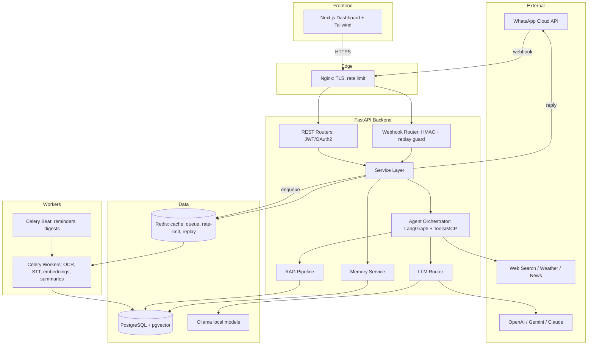

# Architecture — AI WhatsApp Personal Assistant

> A secure, privacy-first, provider-agnostic AI assistant for **your own**
> WhatsApp Business number, integrated **only** through the official
> **WhatsApp Cloud API / Business Platform**.

## 1. Guiding principles

| Principle | In practice |
|---|---|
| **Privacy-by-design** | Messages encrypted at rest (AES-256-GCM), no telemetry, full export/delete, local-only mode via Ollama. |
| **Security-first** | HMAC-verified webhooks with replay window, JWT/OAuth2 dashboard auth, secrets never logged, parameterized queries only. |
| **Provider-agnostic** | Messaging channel, LLM provider, and vector store all behind interfaces (Ports & Adapters). |
| **ToS-compliant** | Official Cloud API only. No unofficial automation of a personal consumer WhatsApp account. |
| **Clean architecture** | Routers → Services → Repositories → DB. Domain logic is framework-free and unit-testable. |
| **Async-native** | FastAPI + async SQLAlchemy + async LLM clients; heavy jobs offloaded to Celery. |

## 2. WhatsApp integration boundary (important)

The assistant connects to a **WhatsApp Business number you own** via Meta's
**official Cloud API**. Messages sent to that number arrive by webhook; the
assistant processes and replies. We deliberately do **not** automate a personal
consumer WhatsApp app through unofficial/reverse-engineered methods — that
violates WhatsApp's Terms and risks a permanent ban. A `MessagingProvider`
interface keeps the channel swappable (Meta direct, Twilio, 360dialog, …).

## 3. System overview (C4-style)



## 4. Inbound message lifecycle

1. Meta → Nginx → `/webhook` (TLS termination, edge rate limits).
2. Webhook security: verify `X-Hub-Signature-256`, enforce replay window,
   dedupe `message-id` via Redis `SETNX`.
3. Ingestion: persist raw message (encrypted body), attach conversation, audit log.
4. Route: body starting with `/` → Command Handler; else → Agent Orchestrator.
5. Agent (LangGraph): load memory + semantic recall → detect intent → plan →
   call tools (function/tool calling or MCP) → reflect → respond.
6. LLM Router selects provider with fallback + cost/latency policy.
7. Heavy work (STT, OCR, PDF, embeddings, long summaries) → Celery; user acked
   immediately, final result delivered when ready.
8. Reply out via `MessagingProvider` → Cloud API.
9. Output validation (PII/secret redaction, injection guard) before send.

## 5. Layered architecture

```
Presentation    → FastAPI routers, Next.js dashboard, Celery entrypoints
Application      → Services (use-cases)
Domain           → Pure models, intents, policies, value objects (no framework deps)
Infrastructure   → Repositories, LLM/Messaging/VectorStore adapters, external clients, cache
```

Patterns: Repository, Service layer, Ports & Adapters / Strategy, Dependency
Injection, Unit-of-Work (async session per request), CQRS-lite read models.

## 6. Core interfaces (ports)

- **MessagingProvider** — `verify_webhook`, `parse_inbound`, `send_text`, `send_media`, `mark_read`.
- **LLMProvider** — `chat`, `stream`, `embed`, `supports_tools`; fronted by `LLMRouter`.
- **VectorStore** — `upsert`, `query`, `delete` (PgVector default, Chroma optional).
- **MemoryStore** — short-term (Redis window) + long-term (pgvector semantic).
- **Tool** — declarative schema + async `run`, exposable over MCP.

## 7. AI / Agent architecture

- **Orchestration:** LangGraph state machine —
  `retrieve_memory → detect_intent → plan → act(tools) → reflect → respond`.
- **Tools/Agents:** reminders, tasks, notes, calendar, web search, weather,
  news, translate, RAG doc-QA, email draft, expense tracker, shopping list,
  travel planner, code assistant.
- **RAG:** chunk → embed → pgvector → hybrid (vector + keyword) retrieval →
  re-rank → context injection with citation tracking.
- **Memory tiers:** working (Redis), episodic (PG), semantic (embeddings),
  profile (durable facts/preferences).
- **Guardrails:** input validation, prompt-injection classifier on inbound and
  on retrieved/tool content, output PII/secret redaction, per-tool allow-lists.

## 8. Data architecture

Tables (normalized in Phase 4): `users`, `sessions`, `api_keys`,
`conversations`, `messages`, `memory`, `embeddings` (pgvector), `documents`,
`files`, `tasks`, `notes`, `reminders`, `settings`, `prompts`, `llm_usage`,
`logs`, `audit_logs`. Sensitive columns encrypted at the application layer;
FKs + indexes + soft-delete for erasure and full export.

## 9. Deployment topology

```
docker-compose: nginx · backend (uvicorn/gunicorn) · worker (celery) ·
beat (celery) · postgres (pgvector) · redis · ollama · frontend (next.js)
```

CI/CD (GitHub Actions): lint (ruff/black/mypy) → test (pytest+coverage) →
security scan (bandit, pip-audit, trivy, gitleaks) → docker build → deploy.

## 10. Key technology decisions

| Concern | Choice | Rationale |
|---|---|---|
| Vector DB | pgvector (default), Chroma optional | One datastore to operate/back up; transactional; Chroma kept for local experiments. |
| Agent framework | LangGraph | Explicit, debuggable, resumable multi-step reasoning. |
| Task queue | Celery + Redis | Mature; Beat scheduling for reminders/digests. |
| Encryption | AES-256-GCM, app-layer | Authenticated encryption; keys rotatable independently of DB. |
| Dashboard auth | JWT access+refresh, OAuth2 | Standard, revocable via session table. |

## 11. Delivery phases

1. Architecture · 2. Folder structure · 3. Configuration · 4. Database ·
5. Authentication · 6. WhatsApp integration · 7. LLM integration · 8. Memory ·
9. RAG · 10. Dashboard · 11. Testing · 12. Deployment.

Each phase is committed to `claude/whatsapp-ai-assistant-pydf5x` and grows a
single draft PR.
